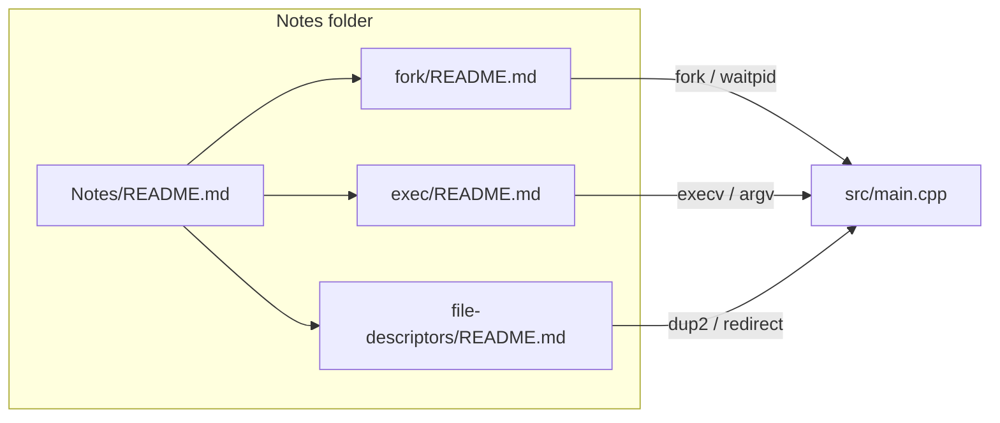
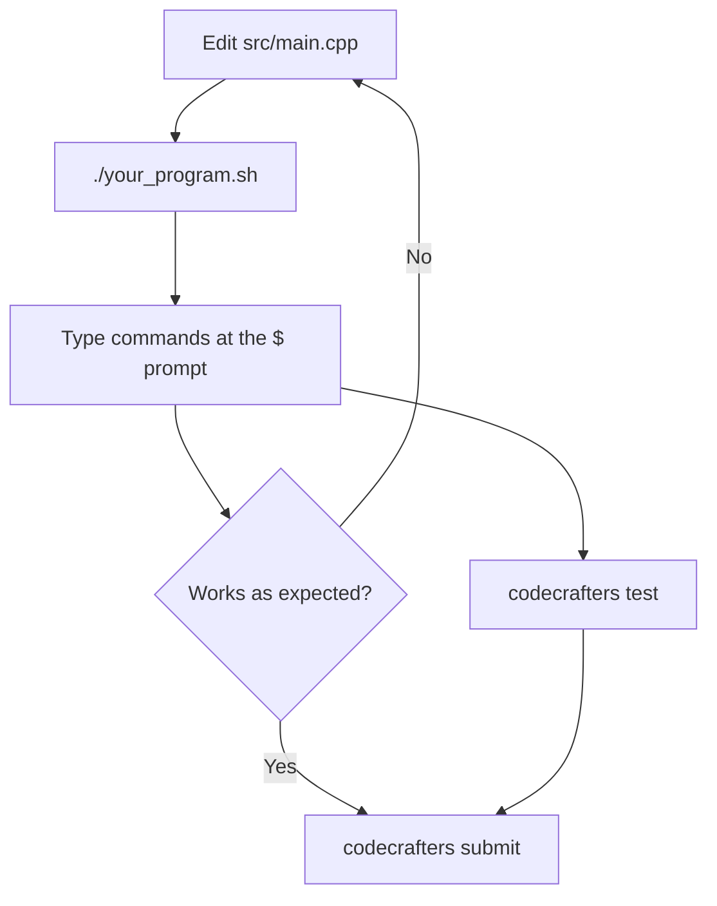

# Concept Notes & Learning Logs

This directory contains subfolders dedicated to core concepts, operating system internals, and C++ mechanisms encountered while building the shell in [`src/main.cpp`](../src/main.cpp).

Each subfolder is a self-contained reference with personal notes, diagrams, and links back to the implementation.

## How the notes relate



**Suggested reading order:** [fork](fork/README.md) → [exec](exec/README.md) → [file descriptors](file-descriptors/README.md) (fork keeps the shell alive; exec replaces the child; file descriptors are what the child inherits after redirection).

---

## Topic index

| Topic | Note | Summary |
| :--- | :--- | :--- |
| Process duplication | [fork/README.md](fork/README.md) | Why the shell calls `fork()` before `execv`, and how parent/child split control flow |
| Executable replacement | [exec/README.md](exec/README.md) | How `execv` overwrites a process, argv rules, and the exec family |
| File descriptors | [file-descriptors/README.md](file-descriptors/README.md) | stdin/stdout/stderr as FD 0/1/2, redirection (`>`, `2>`), `dup2`, and why the program does not need to know the target |

---

## Implementation map

Where each concept shows up in the shell source:

| Concept | Function / region | Lines in `main.cpp` |
| :--- | :--- | :--- |
| PATH search (manual, not `execvp`) | [`find_in_path()`](../src/main.cpp#L42-L53) | 42–53 |
| argv construction + sentinel | [`handle_externals()`](../src/main.cpp#L131-L144) | 131–144 |
| `fork()` | [`handle_externals()`](../src/main.cpp#L147) | 147 |
| Child branch + `execv()` + error path | [`handle_externals()`](../src/main.cpp#L157-L164) | 157–164 |
| Parent `waitpid()` | [`handle_externals()`](../src/main.cpp#L166-L172) | 166–172 |
| Full external-command flow | [`handle_externals()`](../src/main.cpp#L96-L174) | 96–174 |
| REPL dispatches externals | [`main()`](../src/main.cpp#L240-L243) | 240–243 |

---

## Running locally

The shell uses Unix syscalls (`fork`, `execv`, `waitpid`). Build and run in **WSL** (or Linux/macOS), not native Windows PowerShell.



### Prerequisites (WSL)

```bash
cd /mnt/c/Dev/Projects/codecrafters-shell-cpp
```

- **cmake** and **vcpkg** with `VCPKG_ROOT` set
- **CodeCrafters CLI** (for official tests): `curl -fsSL https://codecrafters.io/install.sh | bash`

### Build and run interactively

The main way to try commands before submitting:

```bash
./your_program.sh
```

This compiles the shell (if needed) and starts the REPL. You'll see a `$` prompt — type commands like you would in a real shell:

```text
$ echo hello world
hello world 
$ type echo
echo is a shell builtin
$ ls -l
$ pwd
$ exit
```

### Official stage tests

When you're ready to check against CodeCrafters' test harness (same as submit):

```bash
codecrafters test
```

Use `codecrafters test --previous` to re-run all prior stages plus the current one.

See the [CodeCrafters CLI usage docs](https://docs.codecrafters.io/cli/usage) for more detail.

### Quick one-liner (non-interactive)

Pipe commands without opening the REPL:

```bash
printf 'echo hi\nexit\n' | ./build/shell
```

Note: `./your_program.sh` must have been run at least once so `build/shell` exists.

---

*Created to document foundational concepts learned through practical implementation.*
