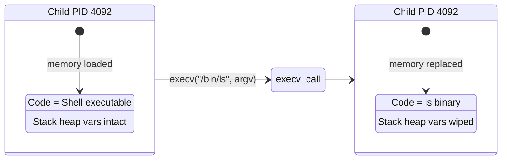
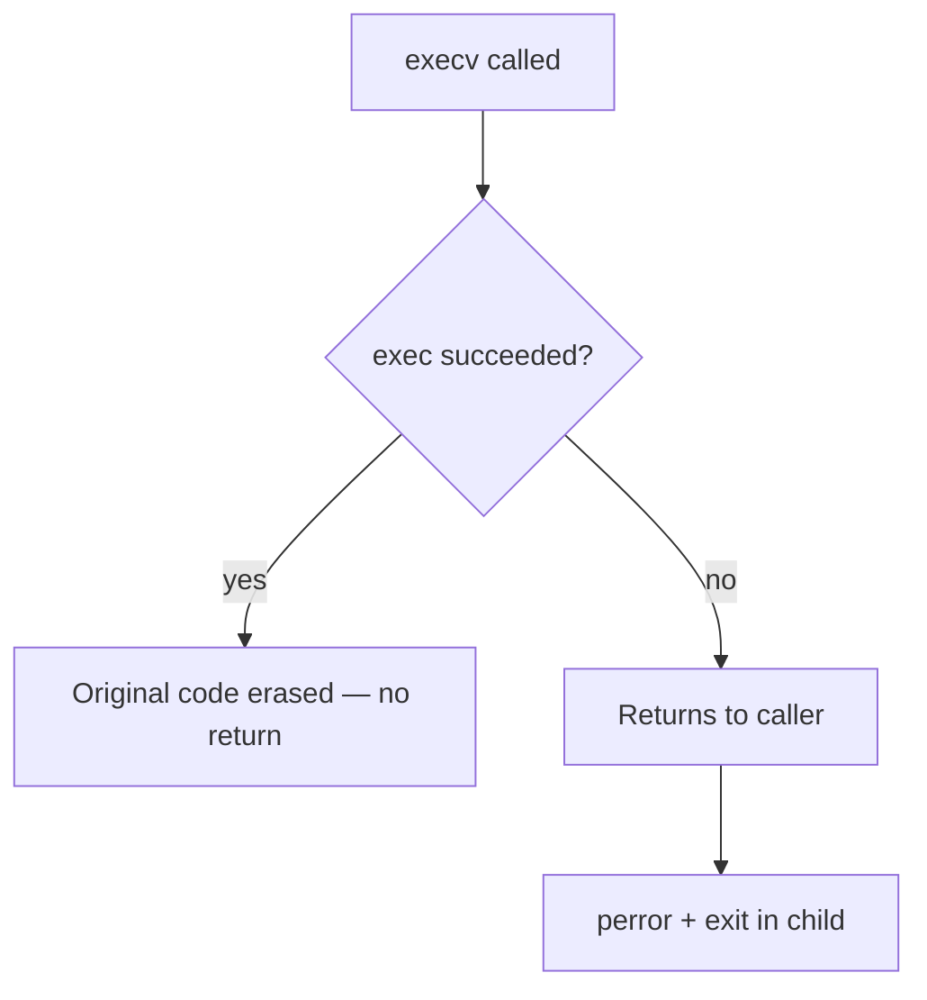

# Executable Replacement & `exec` System Calls in C++

Notes and mental models on how the Unix `exec` family of system calls transforms running processes into new executables.

**Prerequisite:** [Process Management (`fork`)](../fork/README.md)

---

## The Core Concept: Process Overwriting

While `fork()` duplicates a process, the `exec` family of system calls **transforms** a process.

Calling `exec` does **not** create a new process or run a program alongside your code. Instead, it completely erases the memory space of the calling process and replaces it with a new executable program from disk.



> **Key Takeaway:** The Process ID (PID) remains unchanged, but the executable code, variables, and stack inside the process are wiped out and replaced entirely.

---

## Deconstructing `execv` Parameters

When executing commands in C++, `execv` requires two parameters:

```cpp
execv(filepath.c_str(), argv.data());
```

### 1. Filepath (`filepath.c_str()`)

The absolute or relative path to the executable binary on disk (e.g., `"/bin/ls"` or `"/usr/bin/git"`).

### 2. Argument Vector (`argv.data()`)

An array of C-string pointers (`char*`) that must follow three strict rules:

| Index | Content | Requirement |
| :--- | :--- | :--- |
| `argv[0]` | Executable Name/Path | By Unix convention, must be the command name (e.g., `"/bin/ls"`). |
| `argv[1]` ... `argv[n]` | Arguments | The actual command flags/arguments (e.g., `"-l"`, `"-a"`). |
| `argv[n+1]` | `nullptr` (or `NULL`) | **Sentinel Marker.** C arrays lack length metadata; `nullptr` signals to `execv` where the argument list ends. |

> **In this project:** This shell uses `execv` with a manually resolved path from [`find_in_path()`](../../src/main.cpp#L42-L53) rather than `execvp`. The argv vector is built in [`handle_externals()`](../../src/main.cpp#L131-L144) before the child calls [`execv()`](../../src/main.cpp#L159).

---

## The Return Value Paradox

In standard C++, functions execute and return control to the caller:

```cpp
execv(filepath.c_str(), argv.data());

// THIS LINE WILL NEVER PRINT IF EXECV SUCCEEDS
std::cout << "Successfully executed!\n";
```

Because a successful `execv` call completely erases your program from RAM, **your original code no longer exists to run subsequent lines.**



If `execv` returns control back to your code at all, it guarantees that an error occurred (e.g., executable not found, invalid permissions). Proper error handling relies on this behavior:

```cpp
execv(filepath.c_str(), argv.data());

// Reaching this point means execv failed
std::cerr << "Execution failed to launch command\n";
exit(1); // Explicitly terminate the failed child process
```

> **In this project:** The child error path is at [`handle_externals()`](../../src/main.cpp#L161-L163) — `perror` followed by `exit(EXIT_FAILURE)`.

---

## The `exec` Family Naming Conventions

The letters appended to `exec` indicate how parameters are passed to the OS kernel:

| Function | Suffix Letters | Description |
| :--- | :--- | :--- |
| **`execv`** | **`v`** = Vector/Array | Takes arguments as an array of pointers (`char* argv[]`). Requires an exact file path. |
| **`execvp`** | **`v`** = Vector<br>**`p`** = PATH search | Takes an argument array, but automatically searches the system `$PATH` environment variable for the binary. |
| **`execl`** | **`l`** = List | Takes arguments as a comma-separated list of function arguments instead of an array. |

This project uses **`execv`** plus manual PATH walking in [`find_in_path()`](../../src/main.cpp#L42-L53) instead of **`execvp`**.

---

**Prerequisite:** [Process Management (`fork`)](../fork/README.md)
