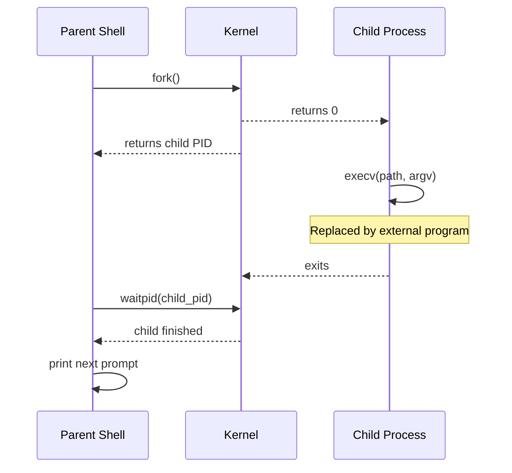
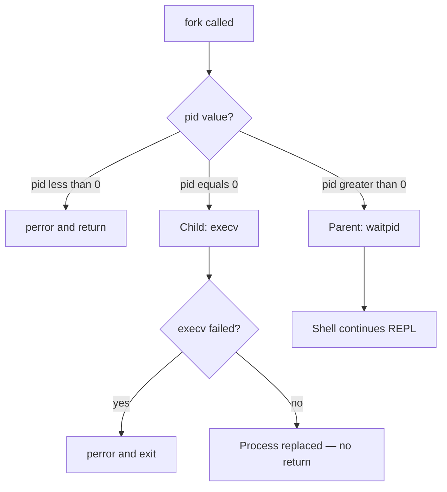
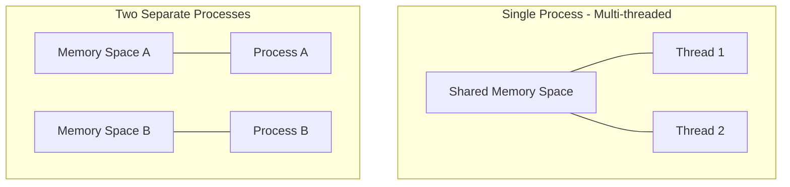

# Process Management & `fork()` in C++

Notes and mental models on how Unix systems execute external commands without crashing or killing the host process.

---

## The Core Problem: Process Overwriting

A program in execution is a **process**. In Unix-like systems, running an external executable (such as `ls`, `grep`, or `cat`) requires calling a system API from the `exec` family (like `execv`).

However, `execv` **does not launch a program alongside your current process**. Instead, it completely wipes out the memory image of the current process and replaces it with the new executable.

If a shell called `execv` directly:

1. The shell process would be erased from RAM and replaced by the new command.
2. The command would run and exit.
3. The original shell would be dead, forcing the user back to the system terminal.

---

## The Solution: `fork()` and Process Duplication

To run external commands while keeping the shell alive, we use **process duplication** via `fork()`.

`fork()` clones the running parent process into an exact duplicate called a **child process**.

### Control Flow Logic

When `fork()` is called, it returns two different values to the two running clones:

* **Child process:** Receives a return value of `0`.
* **Parent process:** Receives the **Process ID (PID)** of the newly created child (`> 0`).

We use standard conditional logic (`if / else`) to assign distinct jobs to each path:

1. **The Child (`pid == 0`):** Calls `execv` to transform into the external program and terminate cleanly upon completion.
2. **The Parent (`pid > 0`):** Calls `waitpid()` to pause execution until the child finishes, then prints the next shell prompt.

---

## In this project

> **In this project:** External commands are handled in [`handle_externals()`](../../src/main.cpp#L96-L174). The shell calls [`fork()`](../../src/main.cpp#L147) to split into parent and child, the child runs [`execv()`](../../src/main.cpp#L159), and the parent blocks on [`waitpid()`](../../src/main.cpp#L166-L172) until the command finishes. The REPL then dispatches non-builtin input to this path from [`main()`](../../src/main.cpp#L240-L243).

See also: [Executable Replacement (`exec`)](../exec/README.md) for how the child transforms after fork.

---

## Multiprocessing vs. Multithreading

It is important to distinguish **multiprocessing** from **multithreading**:

### Visualizing Processes vs. Threads

### Detailed Comparison

| Feature | Process | Thread |
| :--- | :--- | :--- |
| **Definition** | An independent executing program instance with its own private RAM. | The smallest unit of execution inside a process. |
| **Memory** | **Isolated.** Process A cannot read/write Process B's variables directly. | **Shared.** All threads inside a process share the exact same global memory. |
| **Creation Cost** | **Heavy.** Creating a process (`fork()`) requires copying/allocating page tables and OS resources. | **Lightweight.** Spawning a thread (`std::thread`) only allocates a small new call stack. |
| **Crash Impact** | **Safe.** If Process B crashes (e.g., Segmentation Fault), Process A keeps running. | **Fatal.** If one thread crashes, the OS terminates the *entire process* (all threads die). |
| **`execv()` Impact** | Erases **only** the calling child process. | Calling `execv()` on any thread erases **the whole process** and kills all sibling threads. |

---

**Next:** [Executable Replacement (`exec`)](../exec/README.md)
