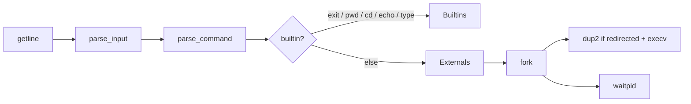

# POSIX-style shell in C++

A Unix shell I built for the [CodeCrafters “Build Your Own Shell”](https://app.codecrafters.io/courses/shell/overview) challenge. It is a small REPL that tokenizes a line of input, runs builtins in-process, and launches external programs with `fork` / `execv` / `waitpid`.

The CodeCrafters starter README is gone on purpose: this repo is the implementation, plus notes I wrote while learning the syscalls behind it.

[](https://app.codecrafters.io/users/BlessedOfficial?r=2qF)

## What it can do

- Interactive `$` prompt; `exit` or EOF leaves the loop
- Builtins: `echo`, `type`, `pwd`, `cd` (including `~` / `$HOME`)
- External commands resolved by walking `PATH` (manual search with `access`, not `execvp`)
- Quoting and escapes close to POSIX: single quotes, double quotes, and backslashes (including the double-quote escape set `"`, `\`, `$`, `` ` ``)
- Stdout redirection: `>` and `1>` (create/truncate the target file, then `dup2` onto FD 1 in the child)

Example session:

```text
$ echo hello world
hello world
$ type echo
echo is a shell builtin
$ pwd
/mnt/c/Dev/Projects/codecrafters-shell-cpp
$ ls > out.txt
$ exit
```

## Layout

The REPL used to live in one `main.cpp`. It is split so parsing, environment lookup, builtins, and process launch stay separate:

| Piece | Role |
| :--- | :--- |
| [`src/main.cpp`](src/main.cpp) | Read–eval loop: prompt, parse, dispatch |
| [`src/parser.cpp`](src/parser.cpp) | Tokenize, then strip `>` / `1>` into a `Command` |
| [`src/builtins.cpp`](src/builtins.cpp) | `echo`, `type`, `pwd`, `cd` |
| [`src/env.cpp`](src/env.cpp) | Split `PATH`, resolve `$HOME`, `find_in_path` |
| [`src/externals.cpp`](src/externals.cpp) | Child process: optional redirect, then `execv` |
| [`include/command.hpp`](include/command.hpp) | `args`, `stdout_file`, `redirect_stdout` |



## How a line is handled

1. **`parse_input`** walks the string once and produces argv-style tokens. Quotes and backslashes are handled in that pass so spaces inside quotes stay one argument.
2. **`parse_command`** pulls redirection operators out of the token list and records the target filename on `Command`.
3. **Dispatch** treats `exit`, `pwd`, and `cd` as shell-owned (they must change the parent process). `echo` and `type` also run in-process. Everything else goes to **`handle_externals`**.
4. Externals look up an executable on `PATH`, `fork`, optionally `open` + `dup2` stdout, then `execv` with a null-terminated argv. The parent waits.

Deeper notes on why `fork` comes before `exec`, what `execv` does to the address space, and how FDs 0/1/2 relate to `>` live under [`Notes/`](Notes/README.md).

## Run it locally

Unix syscalls only: use **WSL**, Linux, or macOS — not native Windows PowerShell.

Needs **cmake** (and the usual C++ toolchain). From the repo root:

```bash
./your_program.sh
```

That compiles if needed and starts the REPL.

Official challenge tests:

```bash
codecrafters test
codecrafters submit
```

Non-interactive smoke check (after a build so `build/shell` exists):

```bash
printf 'echo hi\nexit\n' | ./build/shell
```
